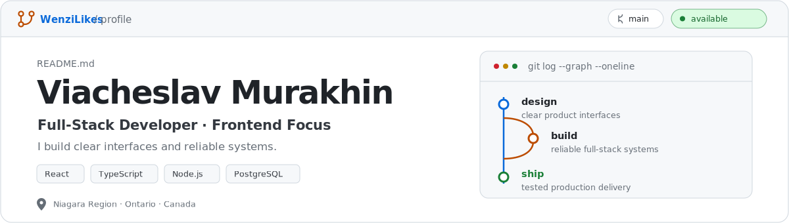

<picture>
  <source media="(prefers-color-scheme: dark)" srcset="./assets/profile-hero-dark.svg">
  <source media="(prefers-color-scheme: light)" srcset="./assets/profile-hero-light.svg">
  
</picture>

<strong>Full-Stack Developer · Frontend Focus</strong> 
Niagara Region, Ontario, Canada

<a href="https://viacheslavmurakhin.com">Portfolio ↗</a> ·
<a href="https://www.linkedin.com/in/viacheslav-murakhin">LinkedIn</a> ·
<a href="https://viacheslavmurakhin.com/documents/viacheslav-murakhin-resume.pdf">Resume (PDF)</a> ·
<a href="mailto:hello@vmnorth.com">Email</a>

> [!NOTE]
> Open to full-stack and frontend-focused product opportunities in Ontario, including hybrid and remote teams.

## What I ship

- **Design** — Responsive React interfaces, reusable components, localization, and clear interaction states.
- **Build** — API-backed product features with authentication, relational data, and real-time workflows.
- **Ship** — Tested, containerized releases with CI/CD, performance checks, and practical documentation.

## Featured repository

### [VMNorth.com](https://github.com/WenziLikes/VMNorth.com) · [Live product ↗](https://vmnorth.com)

A multilingual product platform that connects a public portfolio and sales experience with guided project intake, real-time visitor communication, and secure admin operations.

- **Design** — Created the responsive visual system, localized public flows, reusable UI, and guided intake experience.
- **Build** — Connected React interfaces to Node.js APIs, PostgreSQL data, authentication, publishing tools, and live chat through Server-Sent Events.
- **Ship** — Containerized the application, automated quality checks with GitHub Actions, and documented release operations.

`React` · `TypeScript` · `Vite` · `Node.js` · `PostgreSQL` · `SSE` · `Docker` · `GitHub Actions`

## Additional work

### [E42 Store](https://github.com/WenziLikes/E42-StoreEcommerce) — Full-stack commerce application

An earlier product build covering authentication, catalog and product flows, cart state, Firebase-backed data, and Stripe checkout.

`React` · `TypeScript` · `Redux` · `Node.js` · `Express` · `Firebase` · `Stripe` · `SCSS`

## Toolbox

| Area | Technologies |
| --- | --- |
| Interface | React, TypeScript, JavaScript, HTML, CSS/SCSS, React Router, Redux |
| Server | Node.js, Express, Java, Spring Boot, REST APIs |
| Data | PostgreSQL, MySQL, Firebase |
| Delivery | Vitest, Playwright, ESLint, Docker, GitHub Actions, CI/CD |

---

Available for product-focused engineering work. 
<a href="mailto:hello@vmnorth.com"><strong>hello@vmnorth.com</strong></a>

